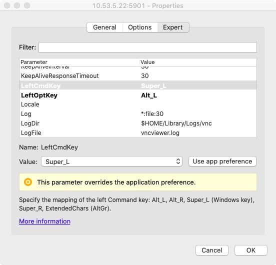

# i3wm

参考 https://i3wm.org/docs/userguide.html  
具体配置在 ~/.config/i3/config

# vnc viewer

在 mac 上用这个  
https://www.realvnc.com/en/connect/download/viewer/macos/

1. 修改连接属性，将 cmd 和 opt 键的配置设置正确，
2. 用全屏模式，保证特殊按键能够被正确捕获
   

# 基本命令

## 查看键盘映射

i3wm 的 mod 键配置
`set $mod Mod4`  
通过命令`xmodmap` 查看本机键盘映射

```
xmodmap
xmodmap:  up to 4 keys per modifier, (keycodes in parentheses):

shift       Shift_L (0x32),  Shift_R (0x3e)
lock        Caps_Lock (0x42)
control     Control_L (0x25),  Control_R (0x6d)
mod1        Alt_L (0x40),  Alt_R (0x71),  Meta_L (0x9c)
mod2        Num_Lock (0x4d)
mod3
mod4        Super_L (0x73),  Super_R (0x74),  Super_L (0x7f),  Hyper_L (0x80)
mod5        Mode_switch (0x8),  ISO_Level3_Shift (0x7c)

```

| 按键          | 用途           |
| ------------- | :------------- |
| \$mod+Enter   | 打开 terminal  |
| \$mod+数字    | 切换桌面       |
| \$mod+m       | 隐藏顶部状态栏 |
| \$mod+shift+m | 打开顶部状态栏 |
| \$mod+d       | 打开应用菜单   |
| \$mod+F4      | 杀掉当前应用   |
| F12           | 打开 yakuake   |

## 中文输入法

已经配置了 fcitx-rime 输入法  
用 \$mod + space 切换输入法,  
右上角有输入法图标

# 远程桌面

```
#如何开启远程桌面
/opt/TurboVNC/bin/vncserver -geometry 1440x900
#查看当前远程桌面会话
/opt/TurboVNC/bin/vncserver -list
#杀掉远程桌面会话
/opt/TurboVNC/bin/vncserver -kill  :1

修改远程桌面密码
/opt/TurboVNC/bin/vncpasswd
```

# 修改桌面分辨率

```
参考脚本
~/.screenlayout/macbook.sh
~/.screenlayout/desktop.sh
```

或者使用 arandr

# enjoy

申请开发这个机器的 5901 端口，然后可以在家里用
